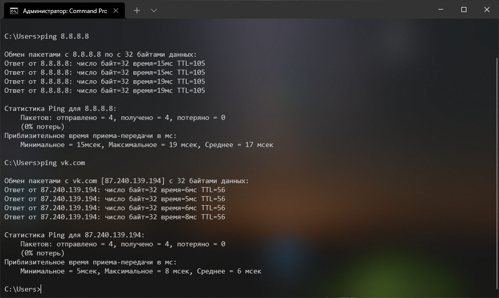
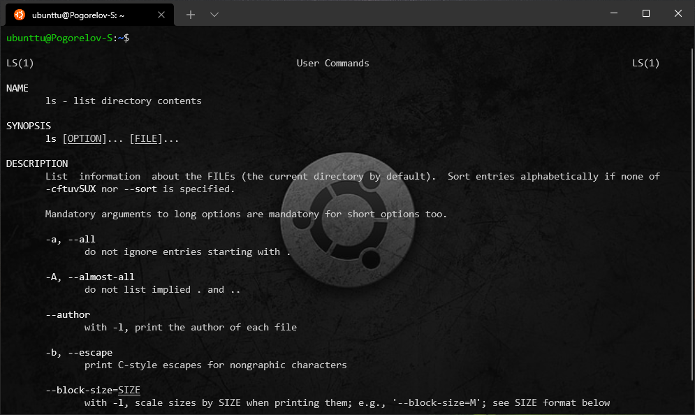
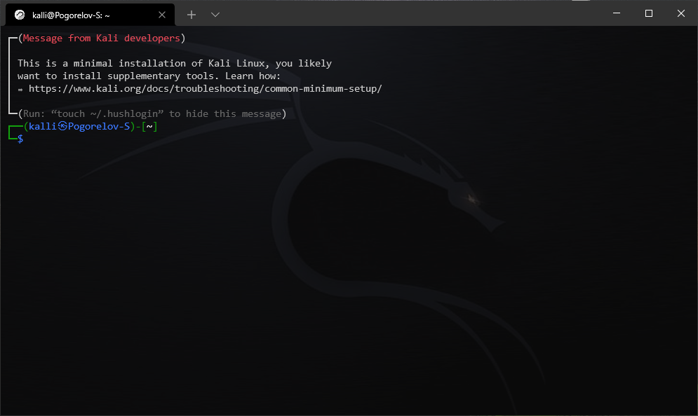

# WindowsTerminalConfig
This is a custom Windows Terminal settings.

## It uses
+ **font Size:** `11`
+ **font Fase** `Consolas`
+ **background Opacity** `Medium`

## Shells
+ Power Shell
+ Command Prompt (cmd) `default`
+ Asure Cloud Shell `desabled`
+ Wsl Ubuntu 20.04
+ Wsl Kali

---
### Comand Prompt
+ **acrylic** `true`

---
### Wsl Ubuntu 20.04

---
### Wsl Kali

